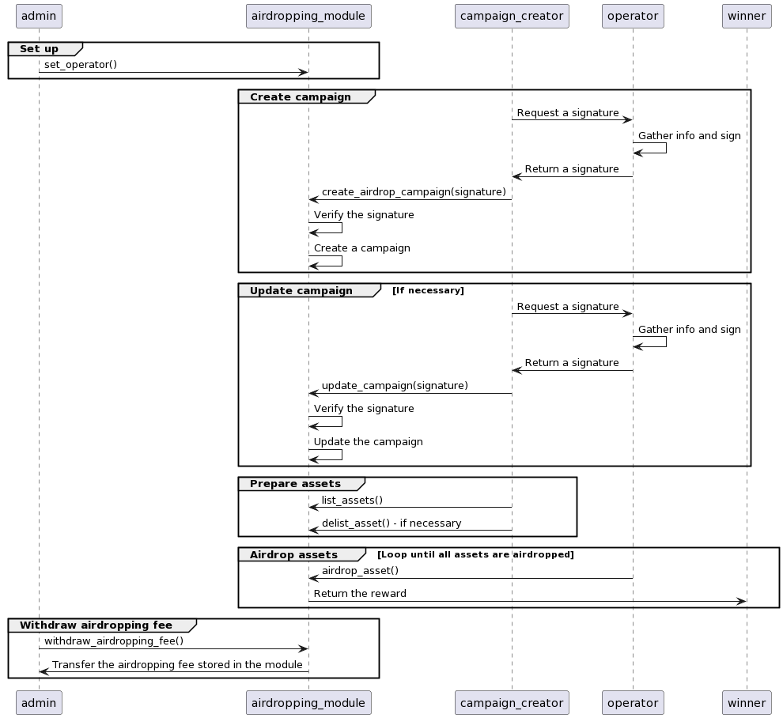
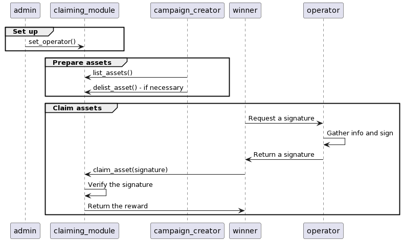

## The airdropping campaigns

The campaign creator creates a campaign in the `auto-reward` mode and lists some assets as rewards. When the campaign ends, the operator wallet will automatically airdrop the rewards to the winners of the campaign.



## The claiming campaigns

The campaign creator creates a campaign in the `reward-claim` mode and lists some assets as rewards. When the campaign ends, the winners of the campaign can claim their rewards. The rewards each of them can claim are managed by the operator.



## Requirements

### Node.js

To run some TS scripts in the project, Node.js 18 is required.

```shell
# To install
$ nvm install 18

# To switch version
$ nvm use 18
```

### TS Node

```shell
$ npm install -g ts-node
```

## Run unit-tests

```shell
$ sui move test
```

## Build the project

```shell
$ sui move build
```

## Publish the package

```shell
$ sui client publish --gas-budget 30000000
```

## Interact with the modules

See [How to interact with the modules](./scripts/README.md).